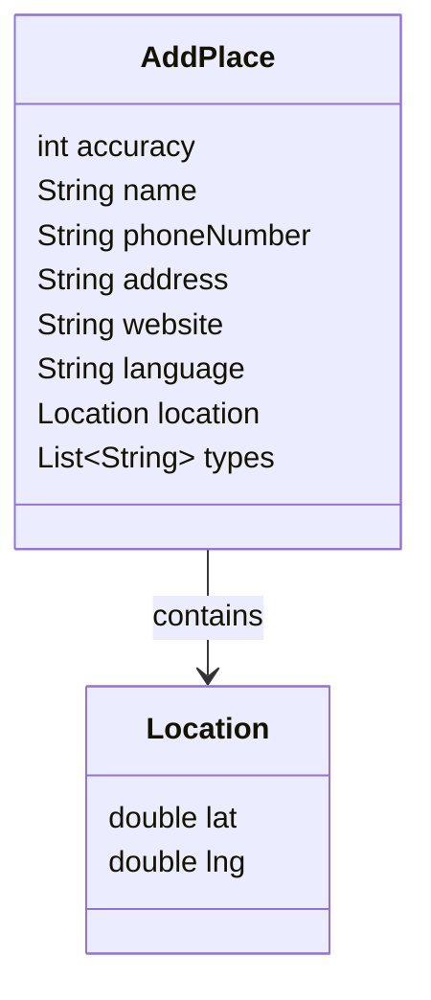

The `pojo` package contains two plain Java objects (POJOs) that model the Add Place request body. REST-Assured serializes these to JSON automatically via Jackson when they are passed to `.body()`, using standard JavaBeans conventions: getter names determine JSON field names.

## `AddPlace`

Represents the top-level request body for the Add Place endpoint. Contains scalar fields and a nested `Location` object.

### Fields

| Field | Type | JSON key | Example value |
|---|---|---|---|
| `accuracy` | `int` | `accuracy` | `50` |
| `name` | `String` | `name` | `"Ritz Carlton"` |
| `phoneNumber` | `String` | `phoneNumber` | `"+20 1234567890"` |
| `address` | `String` | `address` | `"123 Main St"` |
| `website` | `String` | `website` | `"https://rahulshettyacademy.com"` |
| `language` | `String` | `language` | `"French"` |
| `location` | `Location` | `location` | `{ "lat": -40.123456, "lng": 40.987654 }` |
| `types` | `List<String>` | `types` | `["home", "house"]` |

All fields are private with public getters and setters. Jackson uses the getter names to derive JSON keys (e.g. `getPhoneNumber()` → `"phoneNumber"`).

## `Location`

Represents the geographic coordinates nested inside `AddPlace`.

### Fields

| Field | Type | JSON key | Example value |
|---|---|---|---|
| `lat` | `double` | `lat` | `-40.123456` |
| `lng` | `double` | `lng` | `40.987654` |

## Nested relationship

`AddPlace` holds a `Location` instance as a field. When Jackson serializes `AddPlace`, it recursively serializes the `Location` object into a nested JSON object:



## Serialized JSON output

Using the defaults set in [`TestDataBuild.addPlacePayload()`](/reference/test-data-build), REST-Assured sends the following JSON body:

```json
{
  "accuracy": 50,
  "name": "Ritz Carlton",
  "phoneNumber": "+20 1234567890",
  "address": "123 Main St",
  "website": "https://rahulshettyacademy.com",
  "language": "French",
  "location": {
    "lat": -40.123456,
    "lng": 40.987654
  },
  "types": ["home", "house"]
}
```

## How Jackson handles serialization

REST-Assured uses Jackson (bundled with `rest-assured`) for object serialization when the content type is `application/json`. Jackson inspects public getter methods on the POJO:

- `getName()` → JSON key `"name"`
- `getPhoneNumber()` → JSON key `"phoneNumber"` (camelCase preserved)
- `getLocation()` → JSON key `"location"`, recursively serialized
- `getTypes()` → JSON key `"types"`, serialized as a JSON array

<Info>
  No Jackson annotations (`@JsonProperty`, `@JsonIgnore`, etc.) are used in these classes. Serialization relies entirely on getter naming conventions. If you rename a getter, the JSON key name changes and the API call may break.
</Info>

## Full source

<Accordion title="AddPlace.java">

```java
package pojo;

import java.util.List;

public class AddPlace {
    private int accuracy;
    private String name;
    private String phoneNumber;
    private String address;
    private String website;
    private String language;
    private Location location;
    private List<String> types;

    public int getAccuracy() { return accuracy; }
    public void setAccuracy(int accuracy) { this.accuracy = accuracy; }
    public String getName() { return name; }
    public void setName(String name) { this.name = name; }
    public String getPhoneNumber() { return phoneNumber; }
    public void setPhoneNumber(String phoneNumber) { this.phoneNumber = phoneNumber; }
    public String getAddress() { return address; }
    public void setAddress(String address) { this.address = address; }
    public String getWebsite() { return website; }
    public void setWebsite(String website) { this.website = website; }
    public String getLanguage() { return language; }
    public void setLanguage(String language) { this.language = language; }
    public Location getLocation() { return location; }
    public void setLocation(Location location) { this.location = location; }
    public List<String> getTypes() { return types; }
    public void setTypes(List<String> types) { this.types = types; }
}
```

</Accordion>

<Accordion title="Location.java">

```java
package pojo;

public class Location {
    private double lat;
    private double lng;

    public double getLat() { return lat; }
    public void setLat(double lat) { this.lat = lat; }
    public double getLng() { return lng; }
    public void setLng(double lng) { this.lng = lng; }
}
```

</Accordion>
